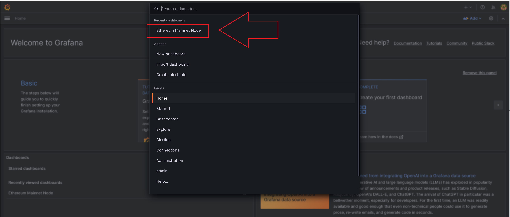
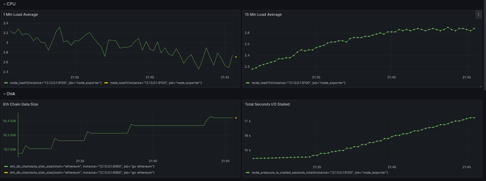
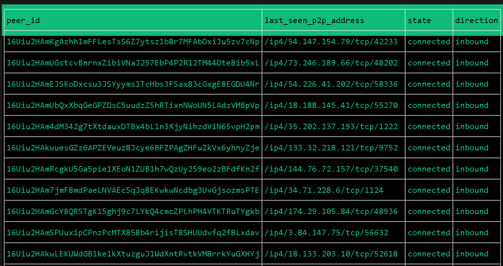

# Automated EC2 Ethereum Node Deployment with Real-Time Monitoring

## Introduction

This project focuses on automating the deployment of an Ethereum node on AWS EC2 using Terraform.

## Deployment Overview

- **Ethereum Node Deployment:**
  - Automates the deployment of an AWS EC2 Ethereum node connected to both the mainnet and beacon (proof-of-stake) chains.
  - Utilizes the Geth client for mainnet connectivity.
  - Utilizes the Prysm client for beacon chain connectivity.
  - Configures Prometheus metrics and Grafana dashboard automatically.

- **Peer Monitoring Program:**
  - Compiles an example Go program to display the connected peer list of the deployed Ethereum node.
  - The peer list is refreshed every two seconds.

## System Requirements

- AWS Account
- bash/zsh (mac, linux, or windows wsl)
- docker

## Infrastructure Deployment with Terraform

:warning: ***Run all commands from a terminal window in the root of this repository***

:warning: ***Docker download messages are normal when running the eth-demo-\* commands for the first time***

### Setup Shell Environment

```bash
$ source env.sh 
$ alias | grep eth-demo
alias eth-demo-build='eth_demo_build'
alias eth-demo-endpoints='eth_demo_endpoints'
alias eth-demo-logs='eth_demo_logs'
alias eth-demo-peers='eth_demo_peers'
alias eth-demo-ssh='eth_demo_ssh_connect'
alias eth-demo-tf='eth_demo_tf'
```

### Initialize Terraform

```bash
$ eth-demo-tf init

Initializing the backend...

Initializing provider plugins...
- Reusing previous version of hashicorp/aws from the dependency lock file
- Reusing previous version of hashicorp/local from the dependency lock file
- Installing hashicorp/aws v5.9.0...
- Installed hashicorp/aws v5.9.0 (signed by HashiCorp)
- Installing hashicorp/local v2.4.0...
- Installed hashicorp/local v2.4.0 (signed by HashiCorp)

Terraform has been successfully initialized!

You may now begin working with Terraform. Try running "terraform plan" to see
any changes that are required for your infrastructure. All Terraform commands
should now work.

If you ever set or change modules or backend configuration for Terraform,
rerun this command to reinitialize your working directory. If you forget, other
commands will detect it and remind you to do so if necessary.
```

### Deploy AWS resources

```bash
$ eth-demo-tf apply -auto-approve
data.aws_ami.ubuntu: Reading...
data.aws_ami.ubuntu: Read complete after 0s [id=ami-0af9d24bd5539d7af]

Terraform used the selected providers to generate the following execution plan. Resource actions are indicated with the following symbols:
  + create

Terraform will perform the following actions:

  # aws_instance.ethereum_mainnet_node will be created
  + resource "aws_instance" "ethereum_mainnet_node" {
      + ami                                  = "ami-0af9d24bd5539d7af"
      + arn                                  = (known after apply)
      + associate_public_ip_address          = true
#
# Output truncated
#
Plan: 12 to add, 0 to change, 0 to destroy.
#
# Output truncated
#
Apply complete! Resources: 12 added, 0 changed, 0 destroyed.

Outputs:

ip = "X.X.X.X"
```

### :clock1: Wait 1-2 minutes after the terraform container launches the EC2 instance. The resulting instance will come fully configured with the following

- geth
  - installed, connected to mainnet, connected to prysm, syncing (default/fast mode).
- prysm
  - installed, connected to BEACON, connected to geth, syncing.
- prometheus
  - installed, scraping geth, node_exporter, and itself.
- grafana
  - installed, prometheus data source configured, and pre-populated with an example custom dashboard.
- All components are run as linux systemd services with automatic restart on process exit. Stdout is also captured, tagged, and logged to syslog.

### View the grafana dashboard. Hopefully, your terminal supports clickable hyper-links.  If not, please copy paste the grafana link from your terminal output to a browser window

```bash
$ eth-demo-endpoints 
Raw IP: X.X.X.X
Grafana: http://X.X.X.X:3000
Prometheus: http://X.X.X.X:9090
Prysm: http://X.X.X.X:3500
```

### Login with ***admin:admin***

### Click "Skip" when prompted to update the default password

### Click the top search bar. Look for "Ethereum Mainnet Node" under recent dashboards



### Spend a few minutes exploring while the blockchain sync begins.  Don't forget to expand all rows :grinning:



### Once ready, switch back to the terminal. Confirm the blockchain sync by remotely tailing the server logs

```bash
$ eth-demo-logs
Jul 26 02:07:55 ip-172-31-26-54 prysm.sh[3981]: time="2023-07-26 02:07:55" level=info msg="Called new payload with optimistic block" payloadBlockHash=0x15322b43fb4e prefix=blockchain slot=6724922
Jul 26 02:07:55 ip-172-31-26-54 prysm.sh[3981]: time="2023-07-26 02:07:55" level=info msg="Called new payload with optimistic block" payloadBlockHash=0x71c46dfe86cb prefix=blockchain slot=6724923
Jul 26 02:07:55 ip-172-31-26-54 prysm.sh[3981]: time="2023-07-26 02:07:55" level=info msg="Called new payload with optimistic block" payloadBlockHash=0xed49b6423b19 prefix=blockchain slot=6724924
Jul 26 02:07:55 ip-172-31-26-54 prysm.sh[3981]: time="2023-07-26 02:07:55" level=info msg="Called new payload with optimistic block" payloadBlockHash=0x618d8d2f64ad prefix=blockchain slot=6724925
Jul 26 02:07:55 ip-172-31-26-54 prysm.sh[3981]: time="2023-07-26 02:07:55" level=info msg="Called new payload with optimistic block" payloadBlockHash=0x1e8f560d04b4 prefix=blockchain slot=6724926
Jul 26 02:07:59 ip-172-31-26-54 geth[3946]: WARN [07-26|02:07:59.744] Snapshot extension registration failed   peer=cd0e3f58 err="peer connected on snap without compatible eth support"
Jul 26 02:08:02 ip-172-31-26-54 prysm.sh[3981]: time="2023-07-26 02:08:02" level=info msg="Called new payload with optimistic block" payloadBlockHash=0xd3eb51430d3f prefix=blockchain slot=6724927
Jul 26 02:08:02 ip-172-31-26-54 geth[3946]: INFO [07-26|02:08:02.276] Forkchoice requested sync to new head    number=17,542,253 hash=d3eb51..fb28ae finalized=17,542,191
Jul 26 02:08:02 ip-172-31-26-54 prysm.sh[3981]: time="2023-07-26 02:08:02" level=info msg="Called fork choice updated with optimistic block" finalizedPayloadBlockHash=0xd461c44c2ff9 headPayloadBlockHash=0xd3eb51430d3f headSlot=6724927 prefix=blockchain
Jul 26 02:08:02 ip-172-31-26-54 prysm.sh[3981]: time="2023-07-26 02:08:02" level=info msg="Processing block batch of size 64 starting from  0x4db0f7c3... 6724928/6959438 - estimated time remaining 20h21m24s" blocksPerSecond=3.2 peers=50 prefix=initial-sync
Jul 26 02:08:03 ip-172-31-26-54 geth[3946]: INFO [07-26|02:08:03.003] Syncing: chain download in progress      synced=27.09% chain=19.31GiB   headers=4,792,320@1.59GiB    bodies=4,752,473@11.86GiB   receipts=4,752,473@5.86GiB    eta=2h7m1.199s
Jul 26 02:08:17 ip-172-31-26-54 geth[3946]: INFO [07-26|02:08:17.599] Syncing: chain download in progress      synced=27.11% chain=19.39GiB   headers=4,794,368@1.59GiB    bodies=4,755,816@11.92GiB   receipts=4,755,816@5.88GiB    eta=2h7m33.104s
```

## Compile and Run Go Monitoring Utility

:warning: ***Run all commands from a terminal window in the root of this repository***

:warning: ***The Ethereum node must be online***

### Build the go source

```bash
$ eth-demo-build
all modules verified
```

### Run the go binary alias (grabs IP saved during the earlier terraform run)

```bash
eth-demo-peers
```

A top/k9s like terminal interface is launched. The list of connected peers is refreshed every two seconds.  Hit CTRL+C to exit.



## Additional aliases & files

- To connect over ssh and inspect the ethereum node:

```bash
eth-demo-ssh
```

- A Docker compose configuration exists in docker/. Syncing the blockchain to a desktop may be inconsistent due to low peer counts. The Docker compose configuration still assists with local development.

- The raw JSON for the gzipped & base64 block of the bootstrap script is located in assets/dashboard.json. It may also be downloaded from the grafana console under the dashboard settings.

## Cleanup

```bash
eth-demo-tf destroy -auto-approve
```
